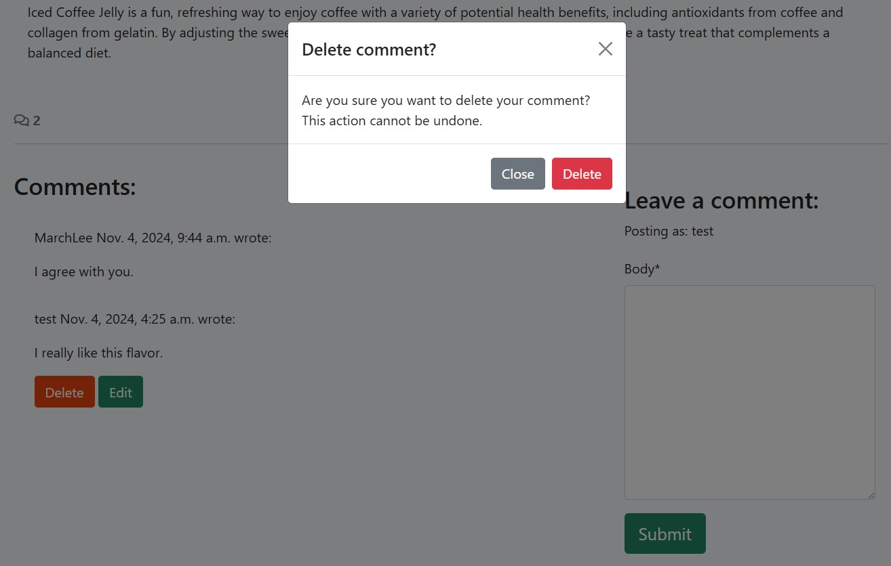
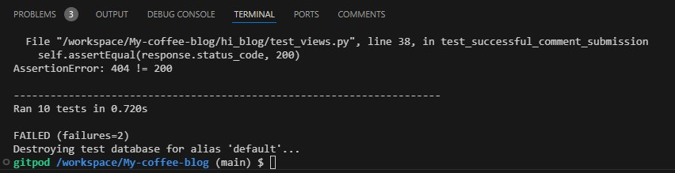
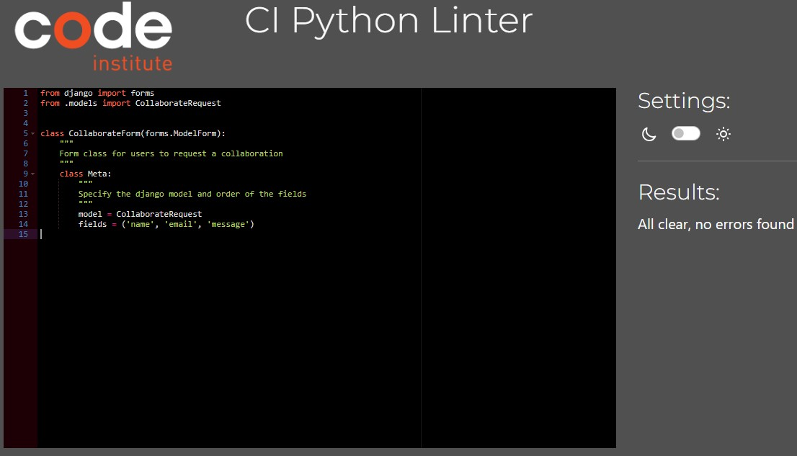

# Mr CoffeePH Blog

Live deployment for the app here https://coffee-lover-blog-500caab782a2.herokuapp.com/

## Introduction

Mr CoffeePH is a comprehensive blog platform dedicated to coffee culture that aims to engage coffee fans of all skill levels. This website is a digital environment where users may explore coffee-related content, tips, and tales, ranging from the complexities of brewing procedures to worldwide coffee trends. The goal is to create a vibrant community of coffee enthusiasts who can easily discover, interact with, and share their enthusiasm for coffee. This blog is not intended to replace Mr CoffeePH's official website https://mrcoffeeph.com/

Mr CoffeePH is built on the Django framework and leverages Django's powerful backend features to provide a scalable, secure, and high-performance platform. Few of the features how Mr CoffeePH delivers a streamlined, engaging experience:

      - Create comments to a post.
      - Read posts.
      - Update posts, either their own (using the edit post option) or others' (by commenting and/or like them).
      - Delete only posts that they created themselves.

The blog's UI is responsive and mobile-friendly, ensuring that users enjoy the best possible experience whether they access it via desktop, tablet, or smartphone. The layout adapts dynamically to screen sizes, providing for seamless navigation, readability, and interaction across all devices.

Users are urged to register accounts in order to develop a sense of community and a more customized experience. Users have access to exclusive interactive features such as the option to "like" blog posts and comment on posts after completing a simple sign-up process.

Registered users can show their enthusiasm for articles by "liking" them. This helps to highlight popular contents on the page, increasing engagement and discussion.
Prompted Login for Interaction: Mr CoffeePH features a nice notification system for users who have not yet logged in.

When an unregistered user tries to interact, they are asked to log in or create an account using the link provided. This small nudge simultaneously improves security and encourages user registration, resulting in a more connected user experience.

An admin dashboard, accessible to moderators and admins, enables effective content control. The Django admin interface makes it simple to publish new posts, manage users, and evaluate user interactions, ensuring that the blog remains relevant and interesting.

## Project Planning

The major goal of this project was to create a simple, user-friendly platform that provides an engaging environment for individuals to exchange and debate coffee-related tales, tips, and content. Key characteristics allow users to:

1. Register for a Personal Account
      - Permission-based access promotes a more controlled and good forum experience, hence creating a welcoming environment.

2. Create comments to a posts using their account name.
      - Allowing individuals to write their own comments and promotes self-expression and meaningful discussions about coffee.

3. Manage posted comments with the option to edit or delete.
      - The platform allows users to change or remove their comments, giving them more control over their personal thoughts on the posts.

4. Read, like, and comment on page's posts.
      - Interaction features such as liking and commenting let users form community ties and interact actively.

5. Administrator Control Over All Content
      - Admins have control and regulates "waiting for approval" comments as appropriate, thereby promoting a safe and friendly atmosphere.

The user stories for this project can be viewed [here](https://github.com/users/GNaces/projects/5)

### Models

Three models were utilized for this project. The Post model controls user postings, the Comment model manages user comments, and the Like model keeps track of who liked the post.

## Project Management

GitHub's KanBan board were utilized to organize the process. [Mr CoffeePH Workflow](https://github.com/users/GNaces/projects/5)

KanBan it provides a flexible and agile way to manage my workload. It is extremely useful for solitary tasks; it improved the efficiency of managing workload through its accessible depiction, resulting in increased production.

The board enabled me to simply move stories through the business delivery lifecycle of To Do -> In Progress -> Done.

## Features

### Welcome to Mr CoffeePH Blog

When users start the app, they are greeted with a landing page consisting of blog posts, which they may peruse even without an account. 
Users who do not yet have an account will see a sign up option in the navbar, allowing them to create one.

Users who have an account will see a navbar with the options to logout and a status that shows them they are signed in, as well as the ability to see user posts and post likes and comments.

### Create An Account

Users can create a personal user account, which allows them to create their own posts. 

### Create Comments and Like on a Blog Post

Once a user's account is set up, they are given more choices such as commenting and liking posts. 

### Delete Comment

Users can manage the comments they have posted. If a user desires to remove and post comments, they may do so. To avoid unintentional deletions, users must indicate that they want to delete their comment before proceeding.

### Edit and Update Comment

Users can also manage their posted comments by changing and updating them as desired.

### About Page

The About Page of MR COFFEE highlights the journey of founders who transformed a simple idea into a successful coffee company through dedication and perseverance. Their commitment to excellence is evident in the extensive trials and taste tests conducted to refine their coffee. Guided by five core values, they emphasize growth and innovation, aiming to provide the best coffee experience in town. Their strong connection with customers, lovingly referred to as "Ka-MC," reflects a community-oriented approach. MR COFFEE represents not just a beverage, but a shared dream brought to life through passion and teamwork.

### About Page Suggestion and Collaboration

The Suggestion and Collaboration form simply asks people for their opinions on future product innovations by asking"Hey! I am curious, have you tried any of the Mr. Coffee products? I'd love to hear your thoughts on how they have worked for you!"

This does not allow invalid input or black on Name, Email and Message.

### Blog Admin

The blog administrator is the site's Django superuser. They can create and delete blog posts. This is a method of moderating the website. They have to review and approve comments for the same reason.

## Features left to implement

- Login via social media account, eg. facebook or google.
- Improving the trust and safety of site based on lighthouse report.

## Testing

### Automated Testing

Django for automated testing was used for this project. Unit test to verify program's separate components, or units, perform as planned.

* Tested forms.py and views.py using Django TestCase in test_forms.py and test_views.py.

### test_forms.py

### test_views.py

### Test Results

* I attempted to test models.py but did not have a clear idea of what to test for, so I opted to go with manual testing for the rest of my program to ensure quality and usability from the user's perspective.

### Django Coverage report

Using Django Coverage I realised that I hadn't covered enough testing with Django TestCase so manual testing was the next step to cover more testing e.g. Like Model.

### Manual Testing
* I used a KanBan board to help plan my manual testing and the points I needed to hit. [Here](https://github.com/users/GNaces/projects/5)

* Post Model blog posts were ordered by creation date, the blog title is returned and that the like count is returned. 

* Comment model comments being ordered by creation date, and commenter name was returned along with the comment. 

* The paths from url.py that I didn't cover in my automated tested which were toggle_like, post_detail, comment_edit and comment_delete are all working.

* If the user isn't logged in they can't create, edit or delete a comment or like a post. The user can view a post and signup or login.

* Logged in users can create, edit and delete their comments and like post and has the ability to sign out.

* Django Admin user can create, edit and delete posts and comments from the Django admin panel, and can approve comments from there too. It can also add user. This gives the admin the ability to moderate the posts on the blog.
     

### Pep8 and Pylint Python Validators

#### About App

* admin.py
 
* apps.py
 
* forms.py 
 
* models.py 
 
* views.py 
 
* test_forms.py

* test_views.py 

#### hi_blog App

* models.py 
 
* views.py 
 

### HTML Validation with Official W3C Validator

 

### CSS Validation with Official W3C Validator

## LightHouse testing

Listed this as next steps for improvement.
      1. HTTPS for All Resources
      2. Implement a Content Security Policy (CSP)
      3. Minimize Third-Party Cookies
      4. Deep dive on the Chrome DevTools Issues Panel

## Responsive testing
This app has been tested on mobile and tablet devices and is responsive.

